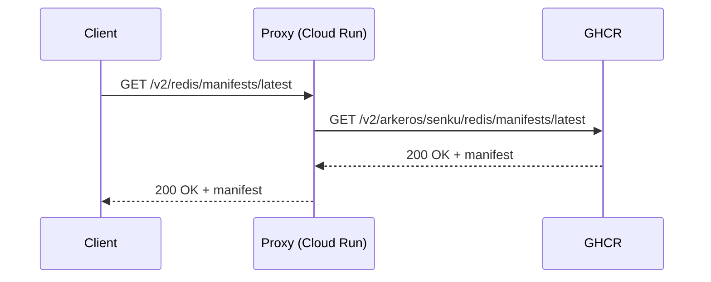
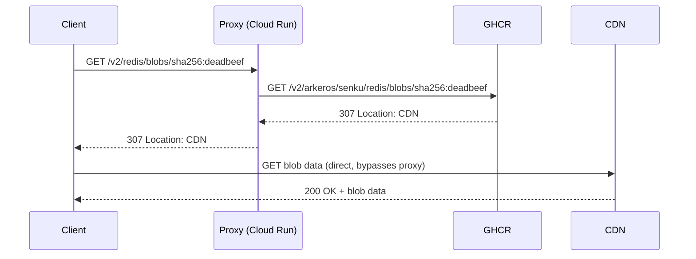

# registry

Pull-only OCI registry proxy that serves images from GHCR under a custom domain.

This is similar in spirit to [archeio](https://github.com/kubernetes/registry.k8s.io/blob/main/cmd/archeio/README.md),
the proxy behind `registry.k8s.io`, but much simpler since we only need to front a single upstream registry.

## Why

**Vanity domain.** Publishing container images to `ghcr.io/arkeros/senku/redis` ties image references to a
specific hosting provider. A custom domain like `distroless.io/redis` decouples the public-facing image name
from the backend, so we can migrate to a different registry (GAR, ECR, self-hosted, etc.) without breaking
existing references.

**Minimal cost.** The proxy only handles metadata requests (manifests, tags). Blob requests — which make up
the vast majority of bandwidth — are redirected to the upstream registry, so the proxy never transfers
image layer data. This keeps Cloud Run costs near zero since blob traffic flows directly between the client
and GHCR.

## How it works

Manifests and tags are proxied (small metadata):



Blobs are redirected (large layer data never flows through the proxy).
GHCR redirects to `pkg-containers.githubusercontent.com`:



The proxy:
1. Receives OCI Distribution API requests at `/v2/<name>/...`
2. Rewrites paths by prepending the repository prefix: `/v2/arkeros/senku/<name>/...`
3. Handles upstream auth transparently via the standard OCI token challenge flow
   (using [go-containerregistry](https://github.com/google/go-containerregistry)'s transport)
4. Passes through redirect responses for blobs — the proxy never serves blob data itself,
   clients are redirected to the upstream's storage backend (CDN) directly

## Usage

```sh
registry --upstream=ghcr.io --repository-prefix=arkeros/senku --port=8080
```

## Supported endpoints

- `GET /v2/` — API version check
- `GET /v2/<name>/manifests/<reference>` — pull manifests
- `GET /v2/<name>/blobs/<digest>` — pull blobs (including redirect passthrough)
- `GET /v2/<name>/tags/list` — list tags

Push is not supported; images are pushed directly to GHCR via CI.

## Deployment

Deployed to Cloud Run in three regions — `us-central1`, `europe-west3`, `asia-northeast1` — by the co-located `tf_root` in [`BUILD`](./BUILD). Each region is a separate service (`registry_us_central1`, `registry_europe_west3`, `registry_asia_northeast1`) sharing one runtime GSA, all emitted by a Starlark loop over the `cloud_run_service` macro at [`//devtools/bifrost/terraform/modules/service_cloudrun:defs.bzl`](../../../devtools/bifrost/terraform/modules/service_cloudrun/defs.bzl).

Image pull path is the shared multi-region `europe` GAR provisioned by [`//infra/cloud/gcp/gar`](../../../infra/cloud/gcp/gar). All three Cloud Run regions pull from the same `europe-docker.pkg.dev/senku-prod/containers/registry@<digest>` URL.

The image is pushed to **two** destinations: **GHCR** for the public `distroless.io` mirror, and **GAR** for Cloud Run's deploy-time pull (Cloud Run can't pull from GHCR directly). Separate Bazel targets for each. `tf_root.image_push` splices the digest URI into the generated `main.tf.json` at Bazel build time, and the same `image_push` target is auto-injected as a `pre_apply` hook so `bazel run :terraform.apply` pushes-then-applies in one command. No tfvars edits, no `var.image` round-trip.

The deploy flow is wrapped by [`deploy.sh`](./deploy.sh):

```sh
./oci/cmd/registry/deploy.sh
```

Which runs:

```sh
bazel run //oci/cmd/registry:image_push_gar    # push to deploy-side GAR
bazel run //oci/cmd/registry:image_tfvars      # digest → image.auto.tfvars.json
(cd oci/cmd/registry/terraform && terraform init && terraform apply)
```

`image.auto.tfvars.json` is gitignored — it rotates on every image build. The GHCR public-mirror push (`:image_push_ghcr`) is separate so a release can gate the public distribution independently. Debug variants: `image_debug_push_ghcr` / `image_debug_push_gar`.

## Testing

```sh
bazel test //oci/pkg/proxy:proxy_test
```

## TODO

- [ ] Add OCI-compliant authentication (token challenge flow on `/v2/`) — the proxy is currently unauthenticated and exposed on the public internet

## See also

- [archeio](https://github.com/kubernetes/registry.k8s.io/blob/main/cmd/archeio/README.md) — Kubernetes' registry.k8s.io proxy, similar architecture
- [OCI Distribution Spec](https://github.com/opencontainers/distribution-spec/blob/main/spec.md) — the spec this proxy implements (pull subset)
